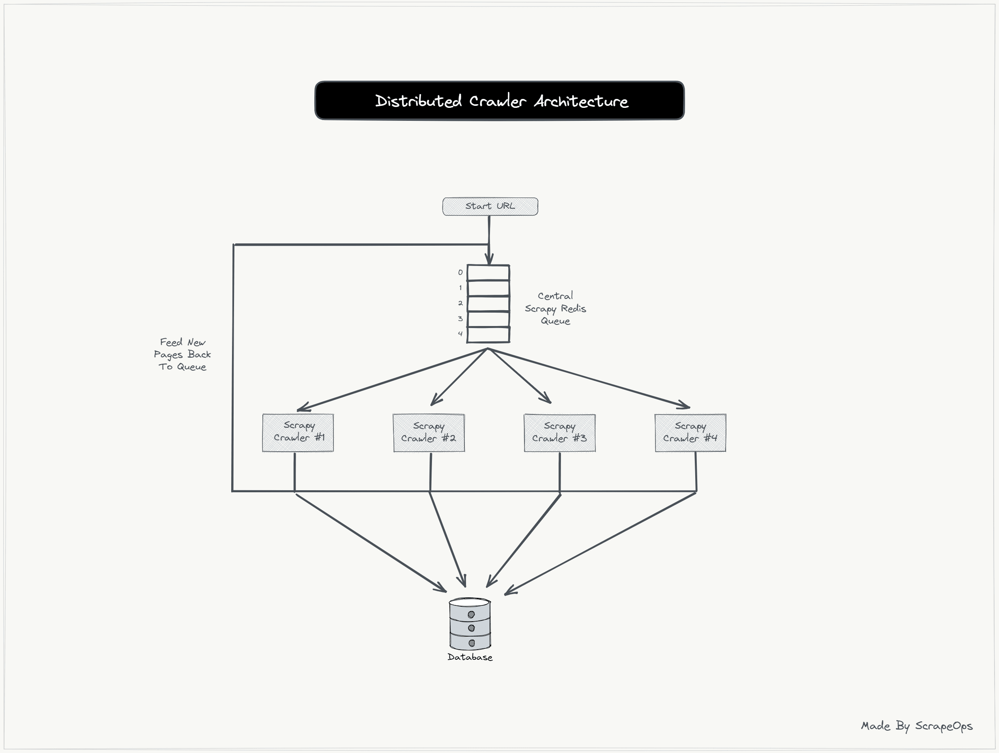
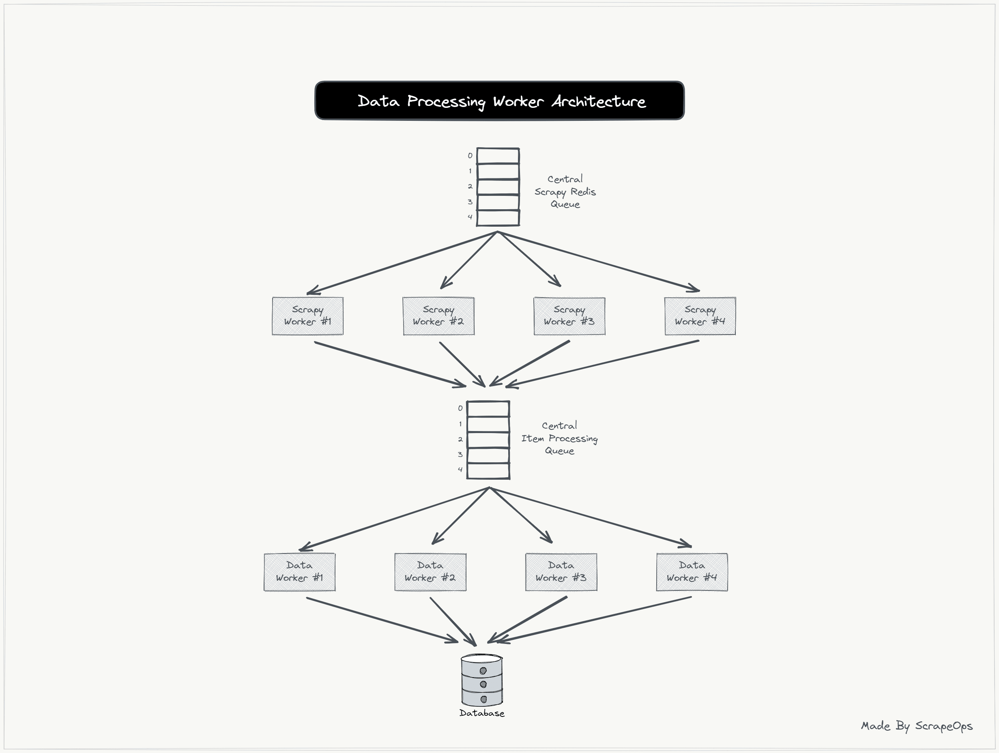

# Khóa học freecodecamp

## Nguồn
https://www.youtube.com/watch?v=mBoX_JCKZTE

## Tạo project scrapy

```sh
scrapy startproject web_crawler
cd web_crawler
scrapy genspider <tên spider> <tên domain: doanhnhansaigon.vn>

web_crawler/
├── scrapy.cfg
├── README.md
├── .env
└── web_crawler/
    ├── __init__.py
    ├── items.py
    ├── loaders.py                  # Định nghĩa các item loader dể xử lý dữ liệu crawl trước khi vào loader.
    ├── middlewares/                # Viết các hàm middleware tùy chỉnh nếu có (proxy, retry, ...)
    │   └── custom_proxy.py
    ├── pipelines/                  # Viết các pipeline xử lý nâng cao như lưu vào db, xuất CSV, xử lý ảnh.
    │   └── export_to_minio.py
    ├── parsers/                    # folder này thường được tạo ra để tách các hàm phân tích html/xml phức tạp ra khỏi file spider chính.
    │   └── product_parser.py
    ├── jobs/                       # dùng khi muốn chạy folder theo kiểu checkpoint với tùy chọn -s JOBDIR=....
    │   └── jobs.py
    ├── tests/                      # Viết unit test cho hàm xử lý HTML hoặc logic crawl.
    │   └── unit.py
    ├── logs/                       # Lưu lại log tiến trình
    │   └── app.logs
    ├── utils.py                    # Chứa các hàm tiện ích như: xử lý ngày tháng, làm sạch dữ liệu, decode HTML,...
    ├── constants.py                # Khai báo các hằng số dùng chung như headers, base URLs, regex pattern,...
    ├── validators.py               # Kiểm tra tính hợp lệ của dữ liệu trước khi vào db
    ├── settings.py
    └── spiders/
        └── my_spider.py

scrapy crawl <my_spider>
```
Có 2 loại middlewares: downloader middlewares (thường hay được sử dụng), spider middlewares. Chọn cái nào thì chỉnh trong setting.py

## Thuật ngữ
1. feed: 1 dòng dữ liệu, nội dung được cung cấp từ soure về đích (như record)
    RSS feed: Dòng tin tức hoặc bài báo từ một trang web
    Data feed: Dòng dữ liệu được cung cấp từ một hệ thống (như api hoặc db) cho ứng dụng khác
    Feed Export: Nơi dữ liệu được xuất ra (export). Trong scrapy hỗ trợ feed export ra nhiều loại như json, csv, ...

2. site = website

## Kỹ năng debug
Truy cập vào scrapy shell bằng lệnh scrapy shell (có thể thay shell mặc định bằng ipython - như jupyter)
Nếu dùng scrapy redis thì khi debug cần bỏ đoạn item pipeline đi để có thể cào tốt hơn.

## Lệnh
1. scrapy list: liệt kê các spider
2. scrapy crawl <tên spider>: chạy 1 con nhện
    option lưu dữ liệu: 
    - thêm -O <tên file><extention> để lưu dữ liệu vào 1 file nào đó, sẽ ghi đè nếu file đã tồn tại
    - thêm -o <tên file><extention> tác dụng tương tự nhưng append vào file nếu nó đã tồn tại
    - sử dụng file setting.py

## 8. Fake User-Agent and Brower headers
Mục đích: làm cho con bot giống như đang sử dụng trình duyệt thật
User-agent: Chứa thông tin của trình duyệt, cần phải fake string này trong header của request để giả dạng trình duyệt thật. 
1. Sử dụng 1 trình duyệt với mọi request (không khuyến khích vì có thể bị chặn)
    - Copy User-Agent String trong tab network: Bật F12 -> Network tab -> Refesh lại trang để xem những gì mà trình duyệt đã request đến server và response của nó, đọc header và lấy
    - Để đọc được thông tin từ chuỗi, truy cập trang web [sau](https://useragentstring.com/) và điền User-Agent vào
2. Fake 1 user-agent mỡi mỗi request
    - Ý tưởng tạo 1 list user/agent và loop qua nó
    - Với các trang web lớn, cần phải tạo list có hàng ngàn user-agent. Hoặc sư dụng Fake User Agent API (chỉ định trong file middlewares.py)
    - [API generator User-Agent](https://scrapeops.io/?fpr=lucas37&gad_source=1&gclid=CjwKCAiAzPy8BhBoEiwAbnM9O-yfrcSfS-0rgtjGz8fmFBTEUaem4rH0MVKA6jfvCX9qKh5MLY7j6hoCpD0QAvD_BwE): Cần phải tạo tài khoản (vohoang.w2002), scrapy cung cấp free
3. Fake toàn bộ header
    - Fake user-agent là không đủ với các trang web lớn như google, amazon, ... cần phải fake toàn bộ request header cho phù hợp với broswer.
    - Sử dụng link api trên có thể làm được

## 9. Proxy
0. Các trang web proxy free 
    - https://geonode.com/free-proxy-list
    - https://free-proxy-list.net/
1. Cho mục đích học tập, tạo máy ảo:
    - Forward Proxy (proxy thuận - đại diện cho client): là máy chủ trung gian giữa client và internet. Có trách nhiệm thay mặt client gửi request đến bất kỳ đâu trong internet (router bgp chẳng hạn hay vpn). Tác dụng, che dấú ip của client (t,hường ip client là private IP thông qua bgp nên cũng chẳng cần che dấu :v), kiểm soát truy cập, lọc nội dung, caching tăng tốc độ truy cập.
    ```sh
        sudo apt install squid -y
        sudo vi /etc/squid/squid.conf
        
        # acl localnet src 192.168.56.0/24   (cho phép các máy thuộc dải mạng trên sử dụng proxy)
        # http_access allow localnet
        sudo systemctl restart squid

        # Test local, mặc định squid chỉ hỗ trợ http, cấu hình https phải thiết lập thêm
        curl -x http://192.168.56.161:3128 -I https://facebook.com
    ```
    - Reverse Proxy (proxy ngược - đại diện cho server): là máy chủ trung gian trong trình duyệt web. Nằm giữa client và các server backend (che dấu được ip server backend) và chuyển tiếp request của client đến server backend phù hợp (cân bằng tải giữa các server backend). Tác dụng cân bằng tải, bảo mật, caching, ssl termination (giải mã SSL/TTS thay cho server backend).
    - Residential Proxies: 
2. Uptime là thời gian mà một dịch vụ (như proxy) hoạt động liên tục mà không bị gián đoạn. Ví dụ, nếu một proxy có uptime 99%, điều đó có nghĩa là trong 100 giờ, proxy đó có thể sẽ ngừng hoạt động 1 giờ. Uptime càng cao thì proxy càng đáng tin cậy và ít bị gián đoạn.
3. Sử dụng project của scrapy
    pip install scrapy-rotating-proxies
4. Phương pháp 1: Liệt kê các proxy vào file setting.py
5. Phương pháp 2: Liệt kê các proxy vào file proxies.txt và thêm đường dẫn của đến file đó vào file setting.py
6. Phương pháp 3: Sử dụng service cung cấp ip và port của proxy hoạt động
    - 2 phương pháp trên đêù có nhược điểm là scrapy phải check từng proxies hoạt động hay ko. Lúc nào cũng phải lo lắng về danh sách các proxies xem nó có bị đổi ip hay ko, ...
    - service này được cung cấp bởi proxy provider và nó mất phí
    - Khi mua cần phải chú ý location. Hầu hết các trang web sẽ hoạt động khác nhau khi ở location khác nhau.

Đi xa hơn, sử dụng service có phí của scrape ops, proxy tự động cung cấp dữ liệu trang web mà ko cần phải fake user-agent hay sử dụng proxy bên thứ 3 nữa. Vẫn tài khoản đó trong scrape ops, đi vào phần proxy và xem video từ

## 10. Run spiders in cloud with scrapyd
1. Scrapyd - Free open source tool để chạy nhiều spider trên một máy chủ từ xa. 
    - Là 1 thư viện python, cần server tự tạo để chạy
    - Chỉ cung cấp api để thao tác, giao diện có thể tùy chỉnh thông qua phần mềm của bên thứ 3.
    - no scheduler
    - Cách sử dụng
    ```sh
    # Cài đặt
    pip install scrapyd -y
    # Chạy scrapyd ở chế độ backgroud
    scrapyd > scrapyd.log 2>&1 &
    # Dùng trình duyệt hoặc curl để check
    curl http://localhost:6800/daemonstatus.json
    # Cài scrapyd client cho máy chứa project và up nó lên server.
    pip install git+https://github.com/scrapy/scrapyd-client.git
    # Điều chỉnh trong file scrapy.cfg để chứa url của server (default là project name trong scrapyd)
    scrapy-deploy default
    # Project sẽ tự sinh ra các thư mục như build, project.egg-info
    # Bây giờ project đã được triển khai thành công lên scrapy và sẵn sàng để chạy
    curl http://localhost:6800/schedule.json -d project=bookscraper -d spider=bookspider
    # Dừng scrapyd
    sudo ss -tunlp (lấy pid và kill nó)
    kill <pid>
    ```

2. ScrapeOps - Free
    - Cần có server riêng tự tạo và cài scrapyd
    - Có UI
    - Có khả năng tạo jobs/spider và mornitor

3. ScrapyCloud - Paid

Triển khai scrapyd
```sh
# Trên máy server scrapyd
git clone --depth 1 https://github.com/nkt780426/Learn-Scrapy.git
sudo apt install python3.10-venv -y
python3 -m venv crawl-data
source crawl-data/bin/activate
cd cd Learn-Scrapy/
pip install -r requirements.txt

cd Learn-Scrapy/crawl-data/lib/python3.10/site-packages/scrapyd/
vi default_scrapyd.conf # Sửa bind_address thành 0.0.0.0 để chấp nhận client từ mọi nơi

# Chạy scrapyd ở chế độ background và ghi log vào file scrapyd.log thay vì in ra terminal
export SCRAPYD_BIND_ADDRESS=0.0.0.0
scrapyd > scrapyd.log 2>&1 &

# Kiểm tra status của scrapyd server từ máy client
(base) user3t@LAP027:~$ curl http://192.168.56.160:6800/daemonstatus.json
{"pending": 0, "running": 0, "finished": 0, "status": "ok", "node_name": "scrapyd"} # Không có job nào pedding, running, finished

# Package spider và up lên srapyd server
# Chỉnh url của server trong file scrapy.cfg
# Theo mặc định scrapy chỉ đóng gói các tệp scrapy lên server. Muốn nó có thêm file proxies.txt cần phải config trong setup.py
# Push spider lên server (như git)
scrapyd-deploy default
(craw_data) (base) user3t@LAP027:~/Workspace/projects/in-process/scrapy/bookscraper$ scrapyd-deploy default
Packing version 1738723310
Deploying to project "bookscraper" in http://192.168.56.160:6800/addversion.json
Server response (200):
{"project": "bookscraper", "version": "1738723310", "spiders": 1, "status": "ok", "node_name": "scrapyd"} # Project name, version push, số lượng spider trong project, status push, hostnamectl của server.
# Scheduler spider
curl http://192.168.56.160:6800/schedule.json -d project=bookscraper -d spider=bookspider
# Kiểm tra job có chạy ko
curl http://192.168.56.160:6800/listjobs.json?project=bookscraper
# Kiểm tra log
curl http://192.168.56.160:6800/logs/bookscraper/bookspider/af830432e36c11efaf13a10e0aa0ee42.log
```
Triển khai scrapydweb
```sh
pip install -r requirements.txt
# Lần đầu tiên chạy sẽ sinh ra file scrapydweb_settings_v10.py ở ~
scrapydweb
# Điều chỉnh cấu hình thành
SCRAPYD_SERVERS = [
    '127.0.0.1:6800'
]
ENABLE_LOGPARSER = True 
LOCAL_SCRAPYD_SERVER = '127.0.0.1:6800'
LOCAL_SCRAPYD_LOGS_DIR = '/home/vohoang/scrapyd/logs'
# Dừng scrapyd và start lại
mkdir scrapyd
cd scrapyd 
scrapyd > scrapyd.log 2>&1 &
# Chạy lại và tận hưởng ở port 5000 (flask)
scrapydweb > scrapydweb.log 2>&1 &
```

## 13. Recap
1. Các vấn đề còn tồn đọng
    - dynamic website: nội dung sinh ra chỉ khi di chuyển view, front-end framework chỉ hiển thị 1 phần thông tin (1 page) mà server gửi. Do đó nếu sử dụng url từ website này sẽ không nhận được data. => Scrapy pupeteer hoặc scrapy selenium
```sh
# dùng để thu thập dữ liệu từ các trang web sử dụng JavaScript động như SPA - Single Page Application. Puppeteer giúp render hoàn chỉnh trang web giúp scrapy lấy được dữ liệu sau khi JS chạy xong
pip install scrapy-puppeteer
# Thêm middleware vào puppeteer
DOWNLOADER_MIDDLEWARES = {
    'scrapy_puppeteer.middleware.PuppeteerMiddleware': 800,
}
# Tạo spider
import scrapy
from scrapy_puppeteer import PuppeteerRequest

class MySpider(scrapy.Spider):
    name = 'myspider'
    start_urls = ['https://example.com']

    async def parse(self, response):
        yield PuppeteerRequest(
            url='https://example.com',
            callback=self.parse_result
        )

    async def parse_result(self, response):
        title = response.css('title::text').get()
        yield {'title': title}
# Dùng khi trang web sử dụng nhiều js để tải nội dung hay ko thể lấy được dữ liệu vì nội dung không có trong html ban đầu, cần tương tác với trang web như click, scroll, điền form, ...
# Nếu chỉ cần lấy dữ liệu từ API ẩn trong trang thì có thể thử Scrapy + request vì puppeteer chậm hơn.
```
```sh
# scrapy-selenium cũng là middleware hỗ trợ crawl dynamic web
# selenium sử dụng webdriver thay vì puppeteer
# Dùng khi cần tương tác với web như click, scroll, điền form, đăng nhập, ...
pip install scrapy-selenium
# Cài thêm web driver nữa
DOWNLOADER_MIDDLEWARES = {
    'scrapy_selenium.SeleniumMiddleware': 800
}

SELENIUM_DRIVER_NAME = 'chrome'  # Hoặc 'firefox'
SELENIUM_DRIVER_EXECUTABLE_PATH = '/path/to/chromedriver'  # Đường dẫn đến WebDriver
SELENIUM_DRIVER_ARGUMENTS=['--headless']  # Chạy không hiển thị trình duyệt
# Ví dụ đơn giản
import scrapy
from scrapy_selenium import SeleniumRequest

class MySpider(scrapy.Spider):
    name = "my_spider"

    def start_requests(self):
        yield SeleniumRequest(
            url="https://example.com",
            callback=self.parse
        )

    def parse(self, response):
        title = response.css('title::text').get()
        yield {"title": title}
```

| 🛠 Công cụ         | 🌍 Trình duyệt                  | 🚀 Hiệu suất  | 🔧 Khi nào nên dùng?                                      |
|-------------------|--------------------------------|--------------|------------------------------------------------------|
| **Scrapy-Selenium**  | Chrome, Firefox, Edge, Safari... | Chậm hơn     | Khi cần tương tác với trang web (click, form...)     |
| **Scrapy-Puppeteer** | Chỉ hỗ trợ Chrome/Chromium    | Nhanh hơn    | Khi chỉ cần render JavaScript mà không cần nhiều tương tác |

Sử dụng 2 công cụ trên sẽ chạy với headless broswer (không cần ui)

2. Login endpoint
3. Scale scrape (nếu phải cào 1000 page 1 ngày thì sao)
    - Sử dụng database để lưu các url cần xử lý, sau đó dùng nhiều server

Đọc link mà khóa học recommend. scrapy-playwright đã thay thế scrapy-puppeteer
https://thepythonscrapyplaybook.com/freecodecamp-beginner-course/freecodecamp-scrapy-beginners-course-part-13-next-steps/

# Khóa học beginer

## Nguồn:
https://www.youtube.com/watch?v=jsQQ2GyFyCg&list=PLkhQp3-EGsIhELaJyhzgLt8CsDywwHfuz&index=3

```sh
git clone --depth 1 https://github.com/ScrapeOps/python-scrapy-playbook.git
```

## Itemloader
- pipeline.py: thường dùng để lưu item vào trong DB, kiểm tra trung lặp item. Để tiền xử lý dữ liệu sau khi đã tạo item (như đổi yên sang vnd)
- itemloader.py: tiền xử lý dữ liệu trước khi tạo item
- item.py: chuẩn hóa dữ liệu

## Fake User-agent
Không cần dùng api để call nữa. Dùng cái này
```sh
pip install scrapy-user-agents
# Thêm vào middleware
# 'scrapy.downloadermiddlewares.useragent.UserAgentMiddleware': None,
# 'scrapy_user_agents.middlewares.RandomUserAgentMiddleware': 400,
```

## Concurently request và Download Delay
```sh
# Số lượng request mà scrapy có thể gửi cùng 1 lúc đến website mục tiêu, mặc định là 16, sửa nó trong setting.py
CONCURRENT_REQUESTS = 16
# Giới hạn concurrent requests cho mỗi domain và ip
CONCURRENT_REQUESTS_PER_DOMAIN = 8  # Số request tối đa cho mỗi domainm tránh bị block khi website có giới hạn request từ cùng 1 domain.
CONCURRENT_REQUESTS_PER_IP = 4      # Số request tối đa cho mỗi IP, hữu ích khi có nhiều proxy và muốn kiếm soát tải

# Kết hợp với DOWNLOAD_DELAY để giảm thiểu bị chặn nếu ko muốn bị chặn khi gửi nhiều request cùng 1 lúc, giảm độ trễ giữa các request
DOWNLOAD_DELAY = 1
# Hoặc kết hợp với Random delay dựa trên tốc độ phản hồi của server
AUTOTHROTTLE_ENABLED = True
AUTOTHROTTLE_START_DELAY = 1    # Bắt đầu với 1 giây delay
AUTOTHROTTLE_MAX_DELAY = 3      # Delay tối đa là 3 giây
AUTOTHROTTLE_TARGET_CONCURRENCY = 2  # Giữ mức 2 request đồng thời
```

## Các extention hay
1. scrapy deltafetch
    - Đảm bảo mỗi url chỉ được crawl 1 lần duy nhất, sử dụng SQLite để lưu danh sách các url đã crawl được. File nằm trong ./scrapy/deltafetch. Bằng cách này sẽ giảm tải lượng request đã crawl.
    - Scrapy DeltaFetch là một middleware trong Scrapy giúp tránh crawl lại dữ liệu cũ mà đã được thu thập trong lần chạy trước đó. Nó tạo ra một "delta crawl", chỉ thu thập nội dung mới trên trang web.
    ```sh
    SPIDER_MIDDLEWARES = {
        'scrapy_deltafetch.DeltaFetch': 100,
    }
    DELTAFETCH_ENABLED = True  # Bật chế độ DeltaFetch
    ```
2. Parse
    ```sh
    # Price Parser
    https://github.com/scrapinghub/price-parser/

    # Date Parser
    [dateparser](https://github.com/scrapinghub/dateparser) is a great little library that allows you to easily parse human readable dates into Python datatimes. 

        >>> import dateparser

        >>> dateparser.parse('Fri, 12 Dec 2014 10:55:50')
        datetime.datetime(2014, 12, 12, 10, 55, 50)

        >>> dateparser.parse('1991-05-17')
        datetime.datetime(1991, 5, 17, 0, 0)

        >>> dateparser.parse('In two months')  # today is 1st Aug 2020
        datetime.datetime(2020, 10, 1, 11, 12, 27, 764201)

        >>> dateparser.parse('1484823450')  # timestamp
        datetime.datetime(2017, 1, 19, 10, 57, 30)

    It supports almost every existing date format: absolute dates, relative dates (`"two weeks ago"` or `"tomorrow"`), timestamps, etc. from over 200 different languages.

    # Number-Parser
    [Number-Parser](https://github.com/scrapinghub/number-parser) is a simple library that converts numbers written in natural language into its numeric form. Examples:

        ## Parse Numbers in Place
        >>> from number_parser import parse
        >>> parse("I have two hats and thirty seven coats")
        'I have 2 hats and 37 coats'

        ## Parse Number
        from number_parser import parse_number
        >>> parse_number("two thousand and twenty")
        2020

        ## Parse Fraction
        >>> from number_parser import parse_fraction
        >>> parse_fraction("forty two divided by five hundred and six")
        '42/506'

    It currently supports cardinal numbers in the following languages - English, Hindi, Spanish and Russian and ordinal numbers in English.
    ```

# Khóa học Scrapy-Playwright

## Nguồn
- Video: https://www.youtube.com/watch?v=EijzO7n2-dg
- Doc: https://scrapeops.io/python-scrapy-playbook/scrapy-playwright/

## Vấn đề
- Scrapy thường chỉ crawl được static website
- playwright là headless broswer (broswer ko có ui) được phát hành bởi microsoft vào 2020 và nhanh chóng trở thành headless broswer phổ biến nhất hỗ trợ nhiều nhân như chromium, webkit, firefox broswer
- playwright thay thế puppeteer (puppeteer chỉ hỗ trợ mỗi chromium)
- JS Render là quá trình tải và thực thi JavaScript trên một trang web để lấy dữ liệu sau khi trang đã hoàn tất render.
    - Tại sao cần ?: 1 số trang web không hiển thị toàn bộ trang web lúc đầu mà sử dụng JavaScript để tải nội dung động như AJAX, React, Vue, Angular, ... Scrapy chỉ lấy dữ liệu html mà ko thực thi file .js :)). Nếu nội dung cần lấy là js sản sinh ra sau 1 thời gian thì scrapy chịu. scrapy-playwright giúp Scrapy có thể render JavaScript bằng cách điều hướng trang qua Playwright (một thư viện hỗ trợ điều khiển trình duyệt tự động).

## Base project

```sh
git clone --depth 1 https://github.com/python-scrapy-playbook/quotes-js-project.git
pip install scrapy-playwright
# Download các web driver (làm 1 lần duy nhất)
playwright install
# Có cảnh báo thiếu package cần thiết thì cài và kiểm tra version, không có lỗi là dùng được (làm 1 lần duy nhất)
playwright install-deps
playwright --version
```

## Thực hành
scrapy crawl quotes -O results.csv
1. Vấn đề 1: trang web mà nội dung của nó được sinh ra bởi javascript sau 1 thời gian
    - Trang web crawl: https://quotes.toscrape.com/js
        - Bật F12->Network refresh lại trang và đọc nội dung file html (js/) sẽ thấy nó chẳng có j cả so với trang web thật.
        - Điều này là do tất cả quotes mà trang web thật có được là js sinh ra.
    - Sử dụng: chỉ cần thêm meta={'playwright': True} vào Scrapy request. Scrapy sẽ dùng playwright để tải trang như một trình duyệt thực sự. Tuy nhiên, đôi khi playwright sẽ kết thúc việc render trước khi page được renders toàn bộ (điều này đặc biệt đúng khi page cực dài). Cần tránh điều này bằng cách thêm các tham số khác. Đóng page playwright lại khi không cần thiết để giải phóng tài nguyên.
    - Chỉ cần đọc file spider
2. Vấn đề 2: trang web mà scroll vô hạn như facebook, linkedin, et cetera, ...
    - Trang web crawl: https://quotes.toscrape.com/scroll
    - Bản chất: khi scroll xuống cuối trang, nó sẽ thực hiện 1 request đến server để lấy nội dung mới. Quá trình naỳ lặp lại vô hạn.
    - Chỉ cần đọc file spider
3. Vấn đề 3: Chụp màn hình
    - playwright có thể chụp màn hình page và lưu :))
    - Chỉ cần đọc file spider

# Khóa học scrapy-selenium, scrapy-splash

Không dùng selenium nữa, playwright mạnh hơn. Tuy nhiên nên biết để tránh bị hỏi khi phỏng vấn.

- Hỗ trợ nhiều loại trình duyệt mà không cần cấu hình driver như selenium
- Hoạt động nhanh hơn, ít tiêu tốn tài nguyên hơn selenium do tương tác trực tiếp với trang web chứ không qua driver.
- Hô trợ tương tác tốt hơn với trang web có nội dung JS động mà ko cần viết nhiều code. Trong khi selenium thì phải viết rất nhiều code tương tác và web có nhiều js động.
- Hỗ trợ chạy song song nhiều phiên trình duyệt một cách dễ dàng, giúp tăng tốc độ kiểm tra và tự động hóa. Selenium cần cấu hình phức tạp hơn.
- Cung cấp các API mạnh mẽ để kiểm tra tất cả các tính năng của trình duyệt như chuột, bàn phím, ...

Không dùng splash, nó không phù hợp để xử lý trang web có js phức tạp như click, scroll, điền form. Tuy nhiên đây lại là headless broser duy nhất được sinh ra chỉ để cào web, nó dễ sử dụng hơn. Hiểu nôm na, cần dựng 1 server splash (docker image có sẵn). Thay vì gửi request trực tiếp đến trang thì mk sẽ gửi đến nó. Nó sẽ tự render trang web toàn bộ và gửi lại.

# Khóa học scrapy login

## Nguồn:
- Doc: https://scrapeops.io/python-scrapy-playbook/scrapy-login-form/
- Youtube: https://www.youtube.com/watch?v=VySakHZi6HI&t=1s

## Phân tích trang đăng nhập
1. Phân tích trang đăng nhập
- URL mà trang web cần login (như amazon chẳng hạn)
- payload của login prompt cần send (form trong html)
- tất cả header và cookies mà request cần thiết để đăng nhập trong tab Network.

2. Lựa chọn method phù hợp để triển khai dựa trên những gì đã phân tích
- Method 1 - SimpleFormRequest: Hiếm trang web nào chỉ yêu cầu các thông tin có trong form html mà thường có thêm cả security token. Tuy nhiên nếu trang web chỉ yêu cầu đơn giản thì chỉ cần thay Scrapy request bằng FromRequest là được.
- Method 2 - FromRequestWithHidenData: Thường sẽ có thêm tham số phụ ngoài trong form có type =hidden (tức là ko thấy trong ui). Tuy nhiên nếu biết chính xác nó là gì thì chỉ cần tạo form như method 1.
- Method 3 - Headless Browser Logins: Một vài trang web đăng nhập phức tạp sẽ chỉ generate hidden data trong js hoặc quá trình đăng nhập rất phức tạp. Lúc này để đơn giản có thể sử dụng headless server để login và tiếp tục scrapy bằng nó, hoặc chuyển cookie cho scrapy request thường.

## Method 1: SimpleFormRequest
1. Trong form đăng nhập có trường csrf_token được ẩn, là access token. Sau đó là 2 trường user, password

# Khóa học scrapy scale

## Nguồn
- doc: https://scrapeops.io/python-scrapy-playbook/scrapy-redis/
- youtube: https://www.youtube.com/watch?v=ZoosqkROKOI
## Tại sao sử dụng scrapy-redis
- Scalable: Giảm thời gian, chi phí crawl dữ liệu
- Reliable: Khi spider bị lỗi, có thể start 1 worker khác bắt đầu từ url bị lỗi trên redis
- Seperated data processing: dễ dàng phân tách data processing pipeline cho các worker và scraping process.
- Syncronizing large crawls: làm việc đa nhiệm với nhiều spider cùng 1 lúc.
## Kiến trúc phân tán


Redis chứa các url cần crawls, vai trò như 1 broker sử dụng giao thức MQTT.
## Kiến trúc phân tán boardcrawl
boardcrawl: thu thập trên diện rộng, nhiều website cùng 1 lúc.
- Vấn đề: lượng dữ liệu lớn và khó chia nhỏ ngay từ đầu, scrapping job có thể tiêu thụ nhiều tài nguyên, khó scale
- Scrapy-redis hoạt động: 
    - các crawler cùng chia sẻ một hàng đợi redis
    - url mới phát hiện được đẩy vào queue chung
    - các crawler lấy url từ queur để xử lý, tránh bị trùng lặp.
    - nếu 1 crawler bị crash thì công việc có thể tiếp tục mà ko mất dữ liệu.
## Seperated Data Processing architech
Khi scraping large scale, nên tách quá trình trích xuất HTML với quá trình xử lý data (item và pipeline). Điều này giúp mở rộng quy mô thu  thập dữ liệu độc lập với nhau và giúp mỗi hệ thống có khả năng chịu lỗi tốt hơn.
Lúc này có thể phân tán 2 lần: lần 1 đọc url từ queue 1 và đẩy queue 2, lần 2 đọc queue 2 và xử lý dữ liệu lưu vào DB.


## Thực hành
- RedisSpider: lấy URL từ Redis và gọi parse() để xử lý
- RedisCrawlSpider: sử dụng rules để thu thập các liên kết theo mẫu, dùng khi url cần truy cập có cấu trúc rõ ràng.
